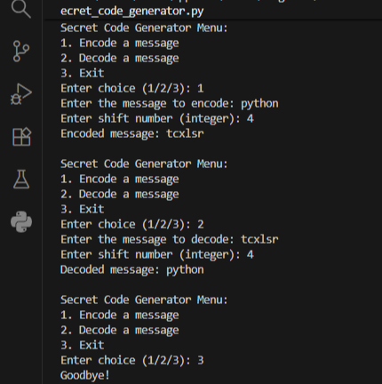

# 🔐 Secret Code Generator using Caesar Cipher

A simple yet powerful **Python program** that allows users to **encode and decode secret messages** using the **Caesar Cipher** encryption technique.  
Each letter in the message is shifted by a fixed number (the *shift value*) to create a coded output.  
This project demonstrates basic encryption logic, string manipulation, and interactive console programming.

---

## 🧠 Features

✅ Encode plain text messages into secret code  
✅ Decode encrypted text back to the original message  
✅ Handles both uppercase and lowercase letters  
✅ Ignores numbers, symbols, and spaces (preserves them as-is)  
✅ Interactive menu-driven program  
✅ Clean, modular, and beginner-friendly Python code  

---

## ⚙️ Tech Stack

- **Language:** Python 3.x  
- **Libraries:** None (uses built-in Python functions)  
- **Concepts:** Loops, conditionals, ASCII manipulation, functions, user input

---

## 🚀 How to Run

### Option 1: Run via Command Line
bash
# Clone this repository
git clone https://github.com/nvn17kpa/secret-code-generator.git

# Navigate into the project directory
cd secret-code-generator

# Run the script
python Secret_code_generator.py
Option 2: Run in any IDE
Open Secret_code_generator.py in VS Code, PyCharm, or Jupyter.

Run the program and follow the on-screen instructions.

🧩 Example Output
Secret Code Generator Menu:
1. Encode a message
2. Decode a message
3. Exit

Enter choice (1/2/3): 1
Enter the message to encode: Hello World
Enter shift number (integer): 3
Encoded message: Khoor Zruog
🧮 How It Works
This project uses the Caesar Cipher algorithm — one of the oldest encryption techniques.
It shifts each letter in the text by a specified number of positions in the alphabet.

Example (shift = 3):
A → D  
B → E  
C → F  
Z → C  
To decode, the process simply reverses the shift.

## 🖼️ Demo

Here’s an example run of the program showing encoding and decoding in action:

📦 File Structure
bash
Copy code
secret-code-generator/
├── Secret_code_generator.py    # Main program
├── README.md                   # Project documentation
├── requirements.txt             # Dependencies (none external)
└── .gitignore                  # Files to ignore in Git

🧠 Learnings
Through this project, I improved my understanding of:

String manipulation in Python

ASCII and character encoding logic

Modular function design

User interaction via command-line menus

Basic encryption and decryption concepts

👨‍💻 Author
Naveena B V
📧 Email: naveenbv.koppa@gmail.com
🔗 GitHub: github.com/nvn17kpa
🔗 LinkedIn: linkedin.com/in/naveen-acharya-777a67383

🏷️ License
This project is open-source and free to use for learning purposes.